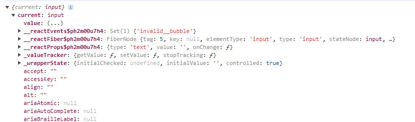

useRef creates a JS object having current property.

| State                                                                       | Ref                                          |
| --------------------------------------------------------------------------- | -------------------------------------------- |
| Cause component re-evaluation when changed                                  | Does not cause component re-evaluation       |
| Should be use for values that are directly updating UI                      | Can be used to get direct DOM element access |
| Should not be use for behind the scenes values, i.e. that have no UI impact | Should be used here.                         |
